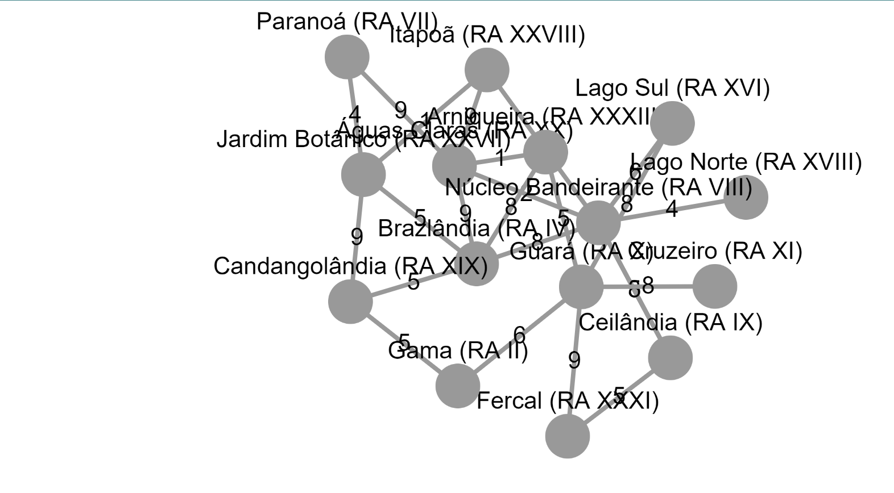

# Grafos 2 - MSTVisualiser

**Número da Lista**: 2 
**Conteúdo da Disciplina**: Grafos2 

## Alunos
|Matrícula | Aluno |
| -- | -- |
| 16/0028361  | Gabriel Batista Albino Silva |

## Sobre 
O projeto tem como objetivo encontrar o melhor caminho para ser percorrido por um entregador começando de um ponto gerando uma arvore geradora minima pelo algoritmo de Prim. No grafo os nós representam cidades e as arestas as estradas parques.

## Screenshots
Exemplo 1:

exemplo 2:

## Instalação 
**Linguagem**: Javascript 
**Framework**: React 

Pré-requisitos: Node v17.4.0

### Instalação:
* Execute o comando `npm install -g yarn`
* Vá até o diretorio do projeto e digite `yarn install`
* Após a conclusão da instalação, execute o comando `npm start`
